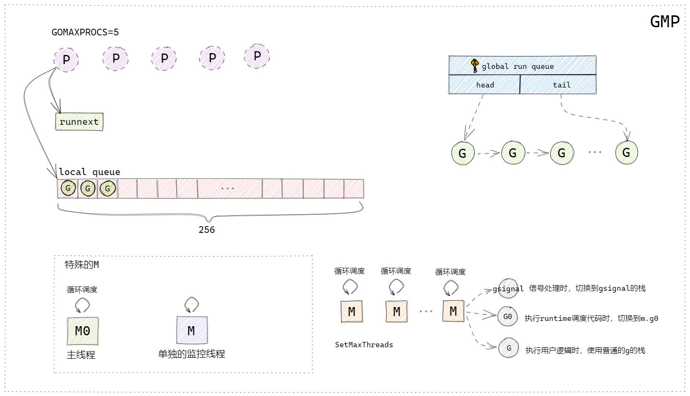

现在无论是客户端、服务端或web开发都会涉及到多线程的概念。那么大家也知道，线程是操作系统能够进行运算调度的最小单位，同一个进程中的多个线程都共享这个进程的全部系统资源。

### 线程

#### 三个基本概念

- 内核线程：在内核空间实现的线程，由内核管理
- 用户线程：在用户空间实现的线程，不归内核管理，由用户态完成管理
- 轻量级进程（LWP）：在内核中支持用户线程（用户线程与内核线程的中间层，内核线程的高度抽象）

#### 线程模型

1. 一对一模型（内核级线程模型）

   由进程创建LWP，由于每个LWP对应一个内核级线程，所以用户也就是在创建一个一个内核线程，由内核管理线程。我们熟知的大多数语言就是属于一对一模型，比如C#、java、c等（这些语言也有相应的方式实现用户态线程，只是语言本身的线程是一对一模型）

2. 一对多模型（用户级模型）

   用户进程创建多个用户级线程对应在同一个LWP上，所以本质上在内核态只会有一个内核线程运行，那么用户及线程的调度就是在用户态通过用户空间的线程库对线程进行管理。

   这类模型优点就是调度在用户态，所以不用频繁地进行内核态与用户态切换，大大提升线程效率。python语言的协程就是这种模型实现的，但是这种模型并不能实现真正意义上的的并发。

3. 多对多模型（用户级与内核级线程模型）

   多对多模型也就是在上述两个模型基础上做一些优点的集合。用户态的多个线程对应多个LWP，但它们之间不是一一对应的，在用户态管理调度每个LWP对应的用户线程绑定关系。

   所以多对多模型是可以有更多的用户态线程在相对于比较少的内核线程上运行的。这种用户态线程也就是我们平时说的协程。Go语言的协程就是多对多模型，它由Go语言的runtime在用户态做调度，这也是Go语言高并发的原因。

### 协程（Goroutine）

前面我们说到，协程就是用户态线程，它的所有调度都在用户态实现，协程这方面Go语言应该是最具代表性的（毕竟以高并发为卖点），以Go语言的协程--Goroutine作为研究对象。

#### GM模型

在Go语言设计的初期，Go团队使用简单的GM模型实现协程。

**G**：goroutine，也就是协程，它一般所占的栈内存为2KB，运行过程中如果栈空间不够用则会自动扩容。它可以被理解成一个被打包的代码段。goroutine并不是一个执行单元。

**M**：machine工作线程，就是真正用来执行代码的线程。由Go的runtime管理好它的生命周期。

在Go语言初期使用一个全局的队列来保存所有的G。当用户新建一个G的时候，runtime就会将打包好的G放到全局队列的队尾，并维护好队尾指针。当M执行完一个G后，就会到全局队列的队头取一个G给M执行，并且维护好全局队列的队头指针。

可以发现这里有个很严重的问题，如果放任随意加入G，也放任任何M随意取G，那么就会出现并发问题。解决并发问题很简单，就是加锁，Go语言团队也确实是这样做的。那么加了锁之后也就代表所有的存取操作都会涉及到这个单一的全局互斥锁，那整个调度的执行效率大打折扣。除了锁导致性能问题以外，还有类似系统调用时，工作线程经常被阻塞和取消阻塞，等等一些问题*[2]*。所以后续官方团队调整了调度模型，加入了P的概念。

#### GMP模型

新的模型中引入了P的概念，G与M没有什么大的变化。

**P**：process处理器，代表了M所需的上下文环境，也可以理解为一个M运行所需要的**Token**，当P有任务时需要创建或者唤醒一个M来执行它队列里的任务。所以P的数量决定了并行执行任务的数量，可以通过runtime.GOMAXPROCS来设定，现在的Go版本中默认为CPU的核心数。

上图根据曹大的GMP模型图自行简化绘制的。

**P结构**：一个P对应一个M，P结构中带有**runnext字段和一个本地队列**，runnext字段中存储的就是下一个被M执行的G，每个P带有一个256大小的本地数组队列，这个队列是无锁的，这两个数据结构类似于缓存的概念，可以有效的解决全局队列被频繁访问的问题，而且runnext和本地队列是PM结构本地的，没有其他的执行单元竞争，所以也不用加锁。

**M结构**：

**runtime中有两个特殊的M：**

①是**主线程**，它专门用来处理主线逻辑；

②是一个**监控线程sysmon**，它不需要P就可以执行，监控线程里面是一个死循环，不断地检测是否有阻塞或者执行时间过长的G，发现之后将抢占这些G。

**普通的M：**

普通的M会有很多个，空闲的M会被放在全局调度器的**m idle（m 空闲）链表**中，在需要m的时候会优先从这里取，取不到的话就会创建新的M，**M创建后就不会销毁**了。每个M结构有三个G，gsignal是M专门处理runtime的信号的G，可以处理一些唤醒机制，G0是在执行runtime调度代码的时候需要切换到的G，还有一个G就是当前M需要执行的用户逻辑的G。

M有几种状态:

- 自旋中(spinning): 暂时还没找到 Goroutine 来执行，但是正在找的一个状态。有这个状态和 nmsping 的计数，能够帮 runtime 判断是不是需要再启动额外的线程来执行 goroutine；
- 执行go代码中: M正在执行go代码, 这时候M会拥有一个P；
- 执行原生代码中: M正在执行原生代码或者阻塞的syscall, 这时M并不拥有P；
- 休眠中: M发现无待运行的G时会进入休眠，并添加到空闲M链表中, 这时M并不拥有P。

#### 调度

整体的调度流程就是一个生产消费过程。用户作为生产者，用户起了一个goroutine后，被打包成一个G，经过runtime的一系列调度后被M消费。

##### 生产端

生产过程主要是指将一个打包好的G放入到队列中的过程。

##### 消费端

消费过程相较于生产过程复杂非常多，主要描述P和M怎样被调度，最终由M完成执行的过程。

前面我们说到，每个M中有一个特殊的G0用来做调度，可以理解成当我们的M没有执行完一个G后，需要切换到G0的栈空间，开始调用schedule函数找一个G来执行，找到后就切到找到的G的栈空间，并且执行它。

这边注意到，在每次执行的时候，会有一个变量在不断的++，这个schedtick我们会在每次schedule函数调度G的时候用到，接下来我们就来看看，每次调用schedule函数是如何找G的。

可以从图中看到，整个寻找可执行G的过程，这个过程中只要找到G，就会结束schedule，返回拿到的G去执行。

1. 在schedule函数中会判断 schedtick%61 == 0，也就是每61次（为什么是61次？我也不知道，算是个魔法数字，凭作者自己的考虑）就去全局队列取一次（确保全局队列中的G会被执行到）。否则我们就去当前M绑定的P的队列中拿，当然优先执行runnext中的G。

2. 当本地队列中找不到可用的G的时候我们就会进入一个findrunnable的函数专门用来找G。

3. 进入findrunnable中首先也是先在当前绑定的P的runnext和本地队列中寻找。

4. 从全局队列中获取，获取的数量是 全局队列的长度/gomaxprocs+1 ，但是最大只能拿128个G到本地队列中，并拿出一个执行。

5. 从netpoll网络轮询器（监控网络I/O和文件I/O等耗时操作的）中获取阻塞的G继续执行。

6. **work stealing**，去其他P（随机算法随机选中的）的本地队列中窃取G到自己这边，窃取的数量是被窃取队列的一半。

7. 再次尝试去全局队列获取。

8. 检查所有空闲的P队列，如果有可运行的G，就去绑定到那个P并执行。

9. 再次尝试去netpoll中获取。

   最后，在整个findrunnable中都没有找到可以执行的G，当前的M就会进入休眠，并放到全局M链表中等待唤醒。

***本文中，忽略了GC方面处理以及很多细节处理，真正的调度流程是非常复杂的，Go语言的官方代码是开源的并且有详细的注释，并且在Go版本升级过程中也会对一些逻辑有所调整，请自行注意时效性（本文基于Go1.15）***

### References

[1]: https://mp.weixin.qq.com/s/Nbl80rQRhuBpe-iJRELKHA	进程、线程与协程傻傻分不清？一文带你吃透！
[2]: https://docs.google.com/document/d/1TTj4T2JO42uD5ID9e89oa0sLKhJYD0Y_kqxDv3I3XMw/edit#heading=h.mmq8lm48qfcw	Scalable Go Scheduler Design Doc

