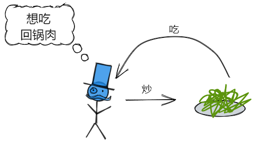
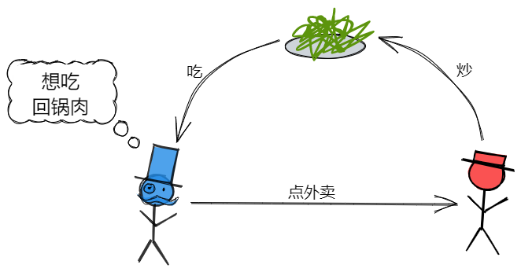

## 对控制反转和依赖注入的突然顿悟

###### 控制反转和依赖注入的概念在网络上有大量的解释，很多都非常的详细，但对我来说过多的解释，容易把我绕来绕去，昨天听大佬的课，突然清晰地顿悟了。希望通过简单的描述，记录我的理解。

### 控制反转（IOC）：

下面通过两张简单的图，了解一下控制反转的思想，我们假设自己现在想吃回锅肉！



首先，我们可以自己炒一道符合自己口味的回锅肉，可以多加肉！然后我们就把它吃掉！！这种情况下**回锅肉炒成什么样由我们自己控制**。

ok！第二天我们又想吃回锅肉了，但是有点懒，我们选择点外卖。



这回我们叫的外卖，那么商家将回锅肉炒成什么样并不是我们能决定的，**也就是回锅肉炒成什么样不是我们能够控制的**，我们就是拿到外卖吃。

很明显回锅肉的控制权从自己变成了别人，这种就叫做控制反转。

在面向对象编程中，每当我们要new一个新的对象的时候，也就是我们所说的实例化对象，一般情况下都是主动new一个新的对象。在IOC思想中，**我们通常把实例化的任务交给别人，也就是自己主动的实例化变为被动的实例化**，自己对实例的控制权被别人替代了，即控制权反转了。我们一般将实例化的任务交给IOC容器统一管理生命周期。

### 依赖注入（DI）：

依赖注入是**实现控制反转思想的一种方式**，其想法就是在对象或属性被初始化的时候，将它所需要的依赖从外部注入进来，并不需要自己内部实例化依赖。

我们通过一段代码来看看为什么注入的依赖符合控制反转的思想。

```go
type Player struct {
	name string
}

type GameRoom struct {
	player *Player
}

//这里我们就将GameRoom依赖的Player从外部注入进来
//Player的实例化也交给了外部，所以对于Player的控制权反转了。
func NewGameRoom(player *Player) *GameRoom {
	return &GameRoom{player: player}
}
```

很多情况下我们会**使用接口注入**，而接口的实例化就归外部（通常是IOC容器），不仅符合多态，更加体现了**依赖倒置原则**（双方都应该依赖一个抽象）。

```go
type Player interface {
	GetName() string
}

type GameRoom struct {
	player Player
}

//Player通过接口的方式注入进来，我们无须
//关系Player如何实现的，这样连注入的依赖
//也变成抽象的
func NewGameRoom(player Player) *GameRoom {
	return &GameRoom{player: player}
}
```

这种方式好处颇多，比如更容易被单元测试、代码耦合性降低等等等等。希望这篇最简单的解释，能够使我们更快地理解IOC和DI的概念。

